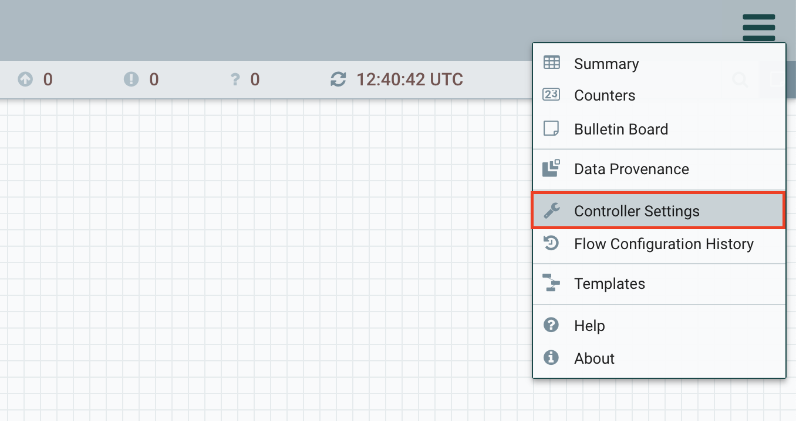
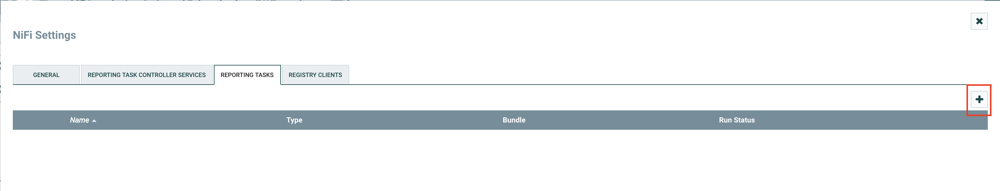
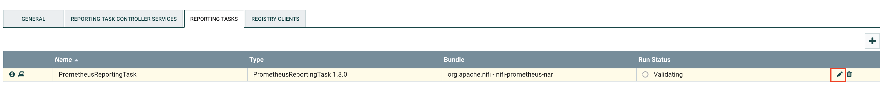
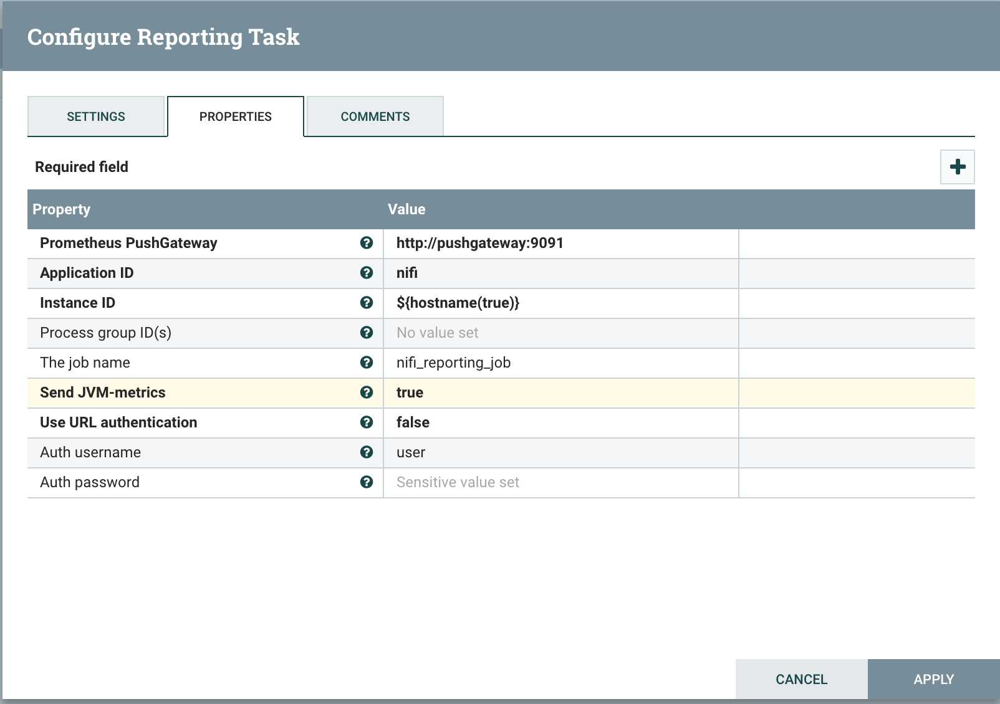
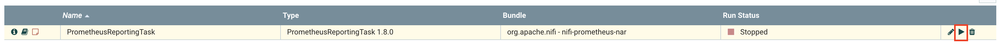

# Configuration

Open your Nifi under http://localhost:8080/nifi and go to the menu in the upper right:

Go to Controller Settings and add a new reporting task:

After the task is added, it has to be configured:

The following settings can be edited: (See the help texts for more details)

After the reporting task is configured, run it:

If everything went well, the prometheus pushgateway (localhost:9091) should now provide your metrics:

After this the metrics can be scraped by prometheus and then visualized in Grafana.